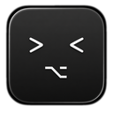

# Opti

  
  
<strong>macOS App / 网站快捷启动工具</strong>

Opti 是一款轻量级 macOS 工具，提供应用快捷切换、网站快捷打开和 Option 长按圆环启动。

## 当前功能

- 应用快捷键：`Option + 1-9 / A-Z` 切换应用
- 网站快捷键：`Option + Command + 1-9 / A-Z` 打开网站
- 圆环模式：按住 `Option` 呼出圆环界面

## 许可证

[MIT License](LICENSE)
