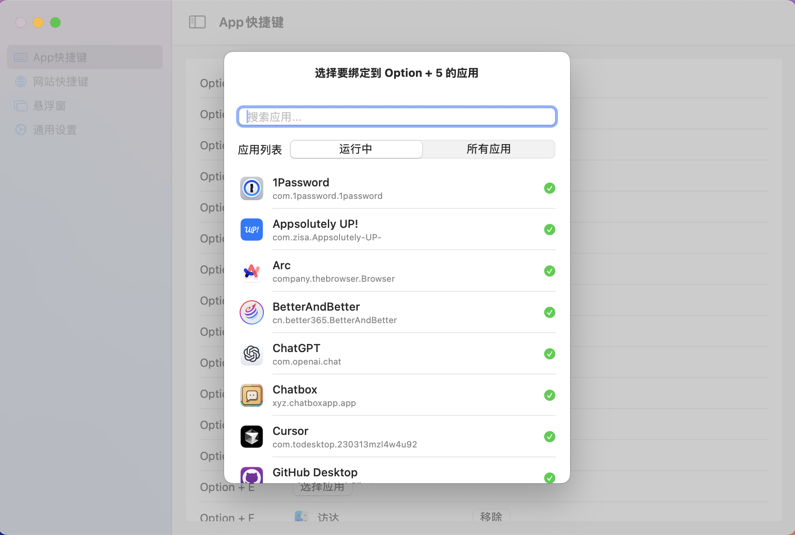
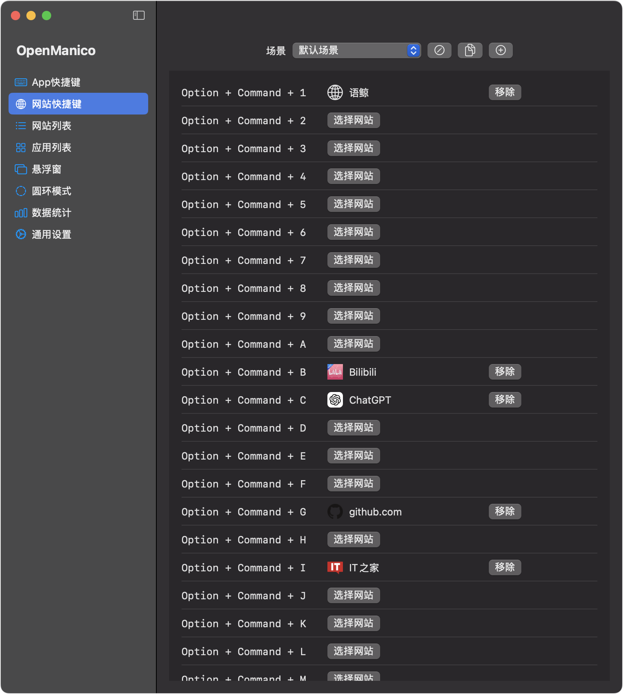
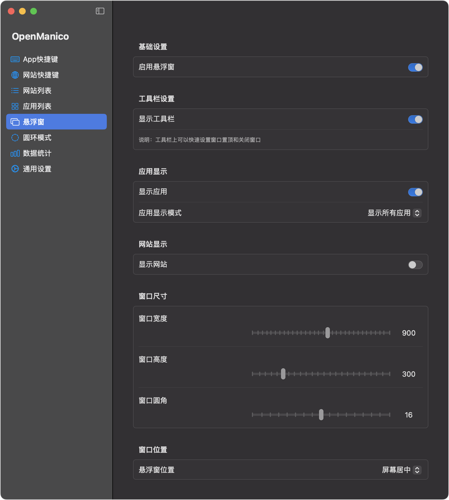
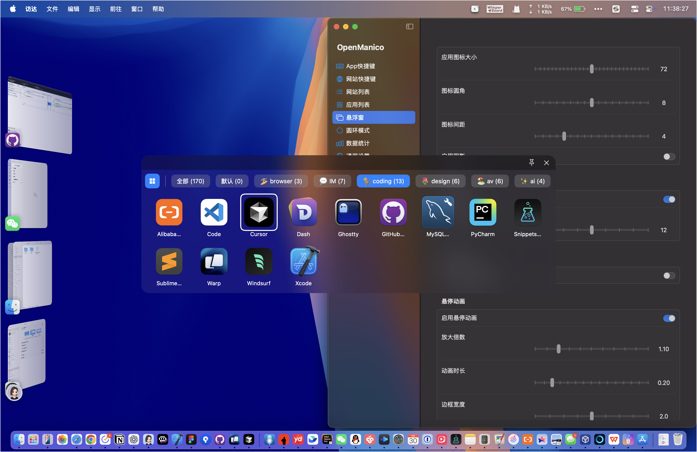

# OpenManico

  
  
<strong>MacOS App/Web 快捷启动工具</strong>

OpenManico 是一个纯 Cursor 编写的轻量级的 macOS 应用程序，通过 Option + 数字/字母键快速切换应用程序，Option + Command + 数字/字母键快速打开网站，提高工作效率。

**重要：致敬 Manico [https://manico.im/](https://manico.im/)，有能力的还是支持下原作者！

如有侵权，请联系我下架！纯免费应用，无任何收费项目！

## 应用截图

   
  
<em>场景配置界面</em>

  
  
<em>App快捷键设置界面</em>

  
  
<em>网站快捷键设置界面</em>

 
  
  
<em>通用设置界面</em>

  
  
<em>悬浮窗设置界面</em>

  
  
<em>悬浮窗界面</em>

## 特性

- 🚀 快速切换：使用 Option + 数字键(1-9)或字母键(A-Z)快速切换应用
- 🌐 网站快捷键：使用 Option + Command + 数字键(1-9)或字母键(A-Z)快速打开网站
- 🔄 双向切换：再次按下相同快捷键可返回上一个应用
- 🎨 主题切换：支持浅色/深色主题，可跟随系统
- 📌 悬浮窗：支持显示悬浮窗，快速查看和使用已设置的快捷键
- ⚡️ 性能优异：后台运行，资源占用极低
- 🔒 安全可靠：无需网络连接，数据本地存储
- 💾 配置导出：支持导出快捷键配置到 JSON 文件
- 📥 配置导入：支持从 JSON 文件导入快捷键配置，方便迁移和备份
   - OpenManico_Shortcuts.json是我的快捷配置供参考
- 🎯 场景管理：应用快捷键和网站快捷键支持场景管理，每个场景可以有不同的快捷键配置

## 安装

1. 从 [Releases](https://github.com/lessismoretest/OpenManico/releases) 下载最新版本
2. 将应用拖入应用程序文件夹
3. 首次运行时授予必要的权限

<strong>首次运行权限设置指南</strong>

1. 辅助功能权限
   - 首次运行时会提示授予辅助功能权限
   - 或手动前往：系统设置 > 隐私与安全性 > 辅助功能
   - 勾选 OpenManico

## 使用方法

1. 应用快捷键设置：
   - 打开应用后，在左侧选择"App快捷键"
   - 点击"选择应用"为数字键或字母键绑定目标应用
   - 使用 Option + 对应按键切换到目标应用
   - 在目标应用中再次按下相同快捷键可返回上一个应用

2. 网站快捷键设置：
   - 在左侧选择"网站快捷键"
   - 在对应的数字键或字母键行输入目标网址
   - 使用 Option + Command + 对应按键快速打开网站
   - 支持网站图标显示，方便识别

3. 悬浮窗使用：
   - 在通用设置中开启悬浮窗功能
   - 悬浮窗会显示当前已设置的快捷键
   - 可以通过拖拽调整悬浮窗位置
   - 支持自定义悬浮窗透明度

4. 配置导入导出：
   - 在通用设置中点击导出按钮（向上箭头）可导出当前所有快捷键配置
   - 点击导入按钮（向下箭头）可导入之前导出的配置文件
   - 支持导入导出 App 快捷键和网站快捷键及场景配置,可单选多选
   - 导入时会自动合并现有配置

## 权限说明

应用需要以下权限才能正常工作：
- 辅助功能权限：用于监听全局快捷键

## 系统要求

- macOS 12.0 或更高版本
- Apple Silicon 或 Intel 处理器
- 约 10MB 可用空间

## 开发环境

- Xcode 15.0+
- SwiftUI
- Swift 5.9+

## 反馈与贡献

- 提交 Issue：[GitHub Issues](https://github.com/lessismoretest/OpenManico/issues)
- 功能建议：欢迎提交 Pull Request

## 许可证

[MIT License](LICENSE)

## 致谢

感谢所有为这个项目提供反馈和建议的用户。 